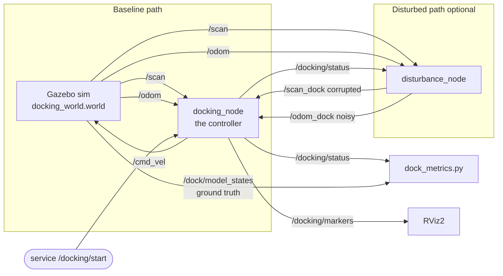
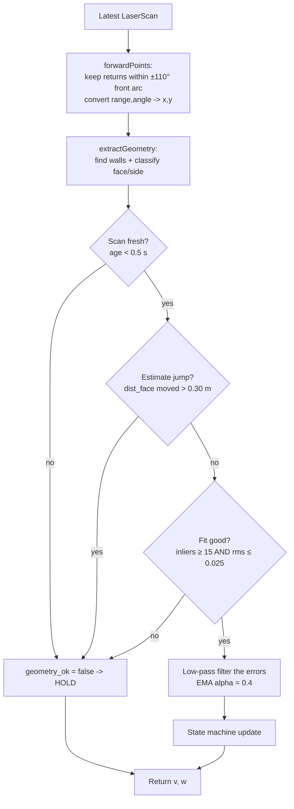
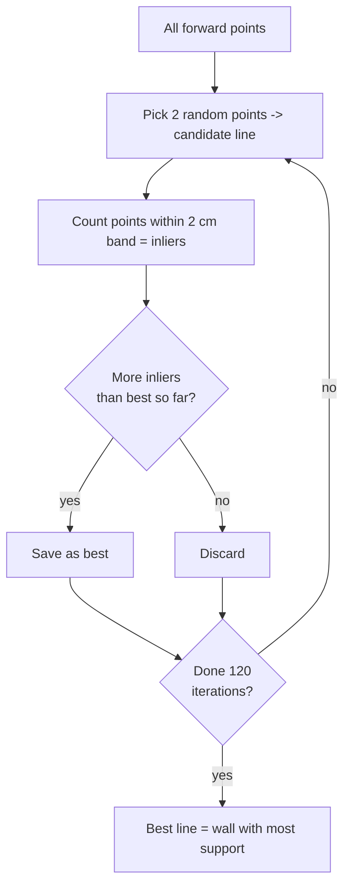
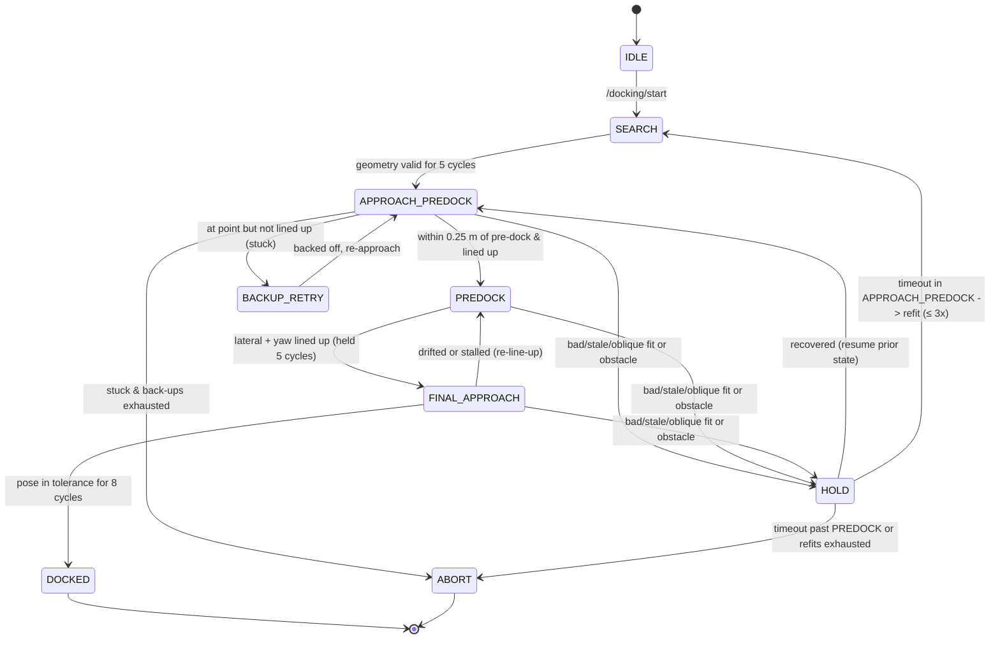

# LiDAR Precision Docking — Implementation Guide

---

## 1. The problem in one picture

A differential-drive robot (TurtleBot3 "burger") must autonomously drive up to a
**dock** and stop at a precise pose using **only its 2D LiDAR** for the final
approach. The dock is an **L-shaped corner** made of two perpendicular walls:

```
            y
            ^
            |                         dock FACE wall  (x = 3.0, runs along y)
   1.6  ----|------------------------#######
            |                              #
            |        robot      ~~~>       #   <-- robot drives toward this wall
   0.5  ----|----------( * )------------>  #        and stops 0.45 m in front
            |        target dock pose      #        (final pose: x=2.55, y=0.5, yaw=0)
            |                              #
   0.0  ====+==============================#====  side wall (y = 0.0, runs along x)
            |                          corner (3.0, 0.0)
            +-------------------------------------> x
```

- **Dock face wall**: the surface the robot ends up facing (square-on). Gives the
  robot its **range** (how far) and **heading** (am I square to it?).
- **Side wall**: perpendicular to the face. Gives the robot its **lateral**
  position (am I centered left/right?).
- **Corner**: where the two lines meet — a single, unambiguous landmark.

**Goal pose** (relative to the dock): stand off **0.45 m** from the face, **0.50 m**
from the side wall, heading **0** (square to the face). In world coordinates that
is `x = 2.55, y = 0.5, yaw = 0`.

The hard part: the LiDAR only gives a cloud of `(range, angle)` returns. We have
to **find the two walls in that cloud**, figure out which one is the face and
which is the side, and turn that into a smooth, safe motion — while tolerating
sensor dropouts, corruption, odometry noise, and a moving obstacle.

---

## 2. Package architecture

Four ROS 2 packages, each with a single responsibility:

| Package | Type | Responsibility |
|---|---|---|
| `docking_sim` | sim assets | Gazebo world (the L-corner walls + a moving obstacle) and the RViz config. |
| `docking_controller` | C++ | Line fitting, geometry extraction, the state machine, and the control laws. |
| `docking_disturbance` | C++ | A fault injector that sits between the sim and the controller to test robustness (dropout, corruption, pose noise, obstacle). |
| `docking_bringup` | launch + python | Glues everything together (`demo.launch.py`) and provides ground-truth scoring (`dock_metrics.py`, `dock_eval.py`). |

### 2.1 Node & topic graph



Key idea: in the **disturbed** configuration the controller is remapped to read
`/scan_dock` and `/odom_dock` (the injector's outputs) instead of the raw sim
topics. The injector republishes the sim data but selectively breaks it. The
controller code does not change at all — it just consumes whatever it is given.

### 2.2 Why the controller is split from the node

`DockingController` (in `docking_controller.cpp`) is **ROS-agnostic**: it takes a
raw `LaserScan` + a timestamp and returns a `{v, w}` velocity command. All the
ROS plumbing (subscriptions, services, timers, markers) lives in `DockingNode`
(`docking_node.cpp`). This makes the algorithm **unit-testable** without a
running ROS graph (see `test/test_line_fit.cpp`).

---

## 3. The processing pipeline (one control tick)

The controller runs at **20 Hz**. Every tick (`DockingController::update`) does:



So a measurement must pass **three gates** before it is trusted:

1. **Freshness** — the scan is newer than 0.5 s (catches dropout / frozen LiDAR).
2. **Continuity** — the face distance did not teleport > 0.30 m since last tick
   (catches latching onto a different wall / corner).
3. **Fit quality** — the line has enough support (≥ 15 inliers) and is tight
   (RMS residual ≤ 0.025 m) (catches weak/oblique/corrupted fits).

If any gate fails, the robot enters **HOLD** (stops) instead of acting on a bad
estimate. This is the safety backbone.

---

## 4. Line fitting

We need to convert a noisy cloud of points into **straight wall lines**. Two
techniques are combined: **RANSAC** to find a line robustly even with outliers,
then **Total Least Squares (TLS)** to refine it precisely.

### 4.1 How a line is represented

A 2D line is stored in **normal form**:

$$a \cdot x + b \cdot y + c = 0, \qquad a^2 + b^2 = 1$$

- `(a, b)` is the **unit normal** (the direction perpendicular to the wall).
- `c` is the offset; because the normal is unit-length, the **perpendicular
  distance from a point** `p` to the line is just:

$$\text{signedDistance}(p) = a\,p_x + b\,p_y + c$$

- The distance from the **sensor origin** (0,0) to the line is simply `|c|`. That
  is exactly the perpendicular distance from the robot to the wall.

(See `LineModel` in `line_fit.hpp`.)

### 4.2 RANSAC — RANdom SAmple Consensus

Imagine you have 200 LiDAR points. Most lie on a wall, but some are noise, the
moving obstacle, or a second wall. A naive average-fit would be dragged off by
those outliers. RANSAC ignores outliers by **voting**:

1. **Pick 2 random points.** Two points define a candidate line.
2. **Count the votes (inliers).** Count how many of *all* points lie within a thin
   band (`inlier_threshold = 0.02 m`, i.e. 2 cm) of that candidate line.
3. **Keep the best.** If this candidate has more inliers than any previous one,
   remember it.
4. **Repeat** `max_iterations = 120` times with new random pairs.
5. The winning line is the one the most points "agree" with — outliers never get
   a say because they don't fall in anyone's band consistently.



The code is in `fitLineRansac` (`line_fit.cpp`). It rejects the result if the
best line has fewer than `min_inliers` votes — i.e. "no real wall here."

### 4.3 TLS refit — making the winner precise

RANSAC's winner is defined by just **2 random points**, so it is robust but not
accurate. We then **refit using every inlier** with **Total Least Squares (TLS)**,
also called orthogonal regression / PCA line fitting.

Why not ordinary least squares (`y = mx + b`)? Because that minimizes *vertical*
error and **blows up for vertical walls** (infinite slope). Our dock face wall is
exactly vertical (`x = 3`), so we must minimize the **perpendicular** distance
instead. That is what TLS does:

1. Compute the **centroid** (mean point) of the inliers — the line passes through it.
2. Build the **2×2 covariance matrix** of the centered points:
   $\begin{bmatrix} S_{xx} & S_{xy} \\ S_{xy} & S_{yy} \end{bmatrix}$.
3. The line **normal** is the eigenvector of the **smallest eigenvalue** (the
   direction of least spread = perpendicular to the wall). The wall direction is
   the eigenvector of the largest eigenvalue.
4. Report the **RMS residual** (how tightly points hug the line) as a quality score.

(See `fitLineTLS` in `line_fit.cpp`. The eigenvalues come from a closed-form 2×2
solution — no iterative solver needed.)

**Summary:** RANSAC = *robust but rough* (ignores outliers); TLS = *precise but
fragile* (uses all points). Run RANSAC first to select the inliers, then TLS on
those inliers → robust **and** precise.

### 4.4 Sequential extraction of multiple walls

To find **both** walls we run RANSAC up to **3 times** (`extractGeometry`):

1. Fit the strongest line → remove its inliers from the cloud.
2. Fit the next strongest line on what's left → remove its inliers.
3. (One more pass as a safety margin.)

Each surviving segment is **oriented** so its normal points from the robot toward
the wall (`orientToWall`), and we record its **normal bearing angle** and
**distance**.

---

## 5. Classifying the two walls (face vs side)

We now have up to 3 line segments. Which one is the **dock face** and which is the
**side wall**? They are classified by the direction their normal points, measured
**in the robot's body frame** (x = forward, y = left):

- **Face wall**: its normal points roughly *ahead* of the robot →
  `|normal_angle| ≤ face_normal_max (55°)`.
- **Side wall**: its normal points roughly *to the right* (−90°) →
  `|normal_angle − (−90°)| ≤ side_normal_tol (45°)`.

### 5.1 The failure mode 

When the robot starts **off-axis** (e.g. rotated ~38° toward the corner), an
obliquely-seen **side wall** can satisfy **both** gates at once. The original code
used a greedy "whichever candidate has the most inliers becomes the face":

```cpp
// OLD (buggy)
if (is_face && inliers > best_face) { face = seg; }
else if (is_side && inliers > best_side) { side = seg; }
```

Because the side wall is **closer and denser**, it had more inliers and **stole the
face slot**. Worse, the `else if` was then skipped, so the **side slot stayed
empty** → no lateral reference → the robot squared up to the *wrong wall*
(ground-truth error ≈ 1.25 m, heading off by 90°).

### 5.2 The fix — mutually exclusive, angle-based roles

We now assign roles by **best angular match**, with **mutual exclusion**:

1. **Side first**: pick the segment whose normal is *closest to −90°* (the side
   wall is the more angularly-distinctive of the two).
2. **Face next**: from the *remaining* segments, pick the one *most square-on*
   (smallest `|normal_angle|`).

```cpp
// NEW (robust)
side_idx = argmin |wrap(normal - side_center)|  over side-eligible segments
face_idx = argmin |normal|                       over remaining face-eligible segments
```

The true dock face can no longer be overwritten by the side wall, and a valid
lateral reference survives an oblique start. This is robust up to ~45° of initial
yaw error; beyond that the two perpendicular walls become genuinely ambiguous
without an orientation prior (the documented "start broadly facing the dock"
assumption).

**Validated:** start `(1.32, 0.92, yaw = −38°)` went from *wrong-wall dock,
|d| = 1248 mm* → **|d| = 11 mm, yaw error 0.2°**; the nominal centered start still
docks cleanly.

### 5.3 What the geometry gives us

Once classified, we compute the relative errors the controller drives to zero
(`DockGeometry`):

| Field | Meaning | Formula |
|---|---|---|
| `dist_face` | perpendicular distance to the face | `|c|` of the face line |
| `dist_side` | perpendicular distance to the side wall | `|c|` of the side line |
| `range_err` | how much too far/near we are | `dist_face − standoff (0.45)` |
| `lateral_err` | how far off-center we are | `dist_side − lateral_offset (0.50)` |
| `yaw_err` | how non-square our heading is | angle of the face normal |
| `corner` | the L-corner landmark | intersection of the two lines |

---

## 6. The state machine (FSM)

The controller is a finite state machine. Each state has one job and a clear exit
condition.



| State | What it does |
|---|---|
| **IDLE** | Sits still. Waits for the `/docking/start` service. |
| **SEARCH** | Doesn't see a valid dock yet. Does a **bounded left-right sweep** (not an endless spin, so it can't wander onto an unrelated corner). Promotes to APPROACH_PREDOCK once geometry is valid for `valid_cycles_to_engage = 5` consecutive ticks. |
| **APPROACH_PREDOCK** | Drives to the **pre-dock point** (1.0 m standoff) using the go-to-pose law, converging position **and** alignment. This is coarse positioning from wherever the robot started. |
| **BACKUP_RETRY** | Reached the pre-dock point but never lined up (out of forward runway): backs straight off the dock by `backup_distance`, then re-approaches. Bounded by `max_backup_attempts`. |
| **PREDOCK** | **Lane-follows** the dock centerline inward, zeroing lateral and yaw error so the final move is a straight push. Always moves forward (arcs onto the line) so the dock never swings out of the LiDAR's view. |
| **FINAL_APPROACH** | Final **straight-in push** to the 0.45 m standoff, trimming heading gently. Has a stall/drift watchdog that falls back to PREDOCK. The last bit of heading is corrected with **pulsed** in-place nudges to beat the drive deadband (a continuous tiny command would hunt/oscillate). |
| **DOCKED** | Pose held within tolerance for `success_cycles = 8` ticks → stop. Done. |
| **HOLD** | Safety stop: bad/stale geometry or an obstacle. Resumes automatically when things clear; on timeout it either **refits** (re-acquire, ≤ 3 times, only if still in APPROACH_PREDOCK) or **ABORTs**. |
| **ABORT** | Gives up safely (stops). Reached only after refits/back-ups are exhausted or a failure past PREDOCK. |

### 6.1 Two-stage approach — why PREDOCK exists

Instead of charging straight at the final pose, we line up at a **pre-dock point
1.0 m out** first, then push straight in. This separates *coarse positioning*
(APPROACH_PREDOCK) from *fine alignment* (PREDOCK → FINAL_APPROACH), which keeps the dock inside
the laser field of view and produces a clean, repeatable final pose.

---

## 7. The control laws

The robot is a **unicycle**: we can only command forward speed `v` and turn rate
`w`. Two laws translate the geometry errors into `{v, w}`.

### 7.1 Go-to-pose (APPROACH_PREDOCK) — polar / Astolfi-style

Drives the robot to a goal pose `(gx, gy, gh)` expressed in the robot frame:

- `rho = hypot(gx, gy)` — distance to the goal point.
- `alpha = atan2(gy, gx)` — bearing to the goal point.
- `beta = gh − alpha` — final heading correction.

```
v = k_range * rho * shape(alpha)        // forward, slowed when goal is to the side
w = k_alpha * alpha + k_beta * beta      // steer toward goal, then settle heading
```

`shape(alpha) = max(0.30, cos(alpha))` keeps a little forward creep even when the
goal is abeam, so the robot **arcs onto** the goal instead of spinning in place
(spinning would swing the dock out of the forward arc). See `goToPose`.

### 7.2 Lane-follow (PREDOCK & FINAL_APPROACH)

Treats the dock centerline like a road lane and always drives forward while
steering to cancel two errors at once:

```
v = k_range * range_to_go * align(yaw_err)       // close the gap, slow if misaligned
w = k_yaw * yaw_err  -  k_cross * lateral_err     // null heading AND cross-track
```

Because it never reverses to turn, it **arcs smoothly onto the centerline**,
keeping the walls in view the whole time. See `laneFollow`.

### 7.3 Smoothing — two layers

1. **Measurement smoothing**: the errors are low-pass filtered with an EMA
   (`error_ema_alpha = 0.4`) so a single noisy scan can't jolt the robot.
2. **Command smoothing**: `v` and `w` are **slew-rate limited** in `DockingNode`
   (`max_lin_accel = 0.4 m/s²`, `max_ang_accel = 1.5 rad/s²`) so the wheels get
   smooth, physically achievable commands.

---

## 8. Robustness / disturbance layer

`disturbance_node` sits between the sim and the controller and injects four
faults, each **gated on the docking stage** (read from `/docking/status`) so they
fire *during* docking and stop once the robot has docked. Each fires **once per
session** (re-armed only from IDLE, not on a refit).

| Disturbance | What it simulates | How the controller survives it |
|---|---|---|
| **Scan dropout** | LiDAR stops publishing for a burst | Freshness gate (scan age > 0.5 s) → HOLD, then resume. |
| **Scan corruption** | Forward sector blanked to +∞ (glass/occlusion) | Fit-quality gate (too few inliers / high residual) → HOLD. |
| **Pose noise** | Gaussian noise added to `/odom_dock` | **No effect on control** — the control loop is **scan-only**; odom is cached but never used to steer. This is the key robustness property. |
| **Moving obstacle** | A cylinder driven into the approach corridor | Corridor obstacle check → HOLD until it clears, then resume. |

**Why scan-only control matters:** because the final approach uses *only* the
live LiDAR geometry (never odometry), injecting odometry/pose noise cannot corrupt
the dock estimate. This is also why we deliberately **do not anchor the dock
target to odom** — doing so would re-introduce exactly the noise the design avoids.

The injector supports **scenario presets** via `disturbance_case` (any other
value keeps all disturbances on): `1 = scan corruption + pose noise + obstacle`,
`2 = scan dropout/stale + pose noise + obstacle`.

---

## 9. Full parameter reference

All controller parameters live in `docking_controller/config/docking_params.yaml`
and are documented inline. Angles are declared in **degrees** and converted to
radians by the node.

### 9.1 Geometry & field of view
| Parameter | Default | Meaning |
|---|---|---|
| `forward_arc` | 1.9199 (110°) | Half-arc of forward LiDAR points used. |
| `face_normal_max` | 0.9599 (55°) | A segment whose normal is within this of "ahead" can be the face. |
| `side_normal_center` | −1.5708 (−90°) | Expected direction of the side-wall normal (to the right). |
| `side_normal_tol` | 0.7854 (45°) | Tolerance band around the side-wall normal. |

### 9.2 RANSAC line fit
| Parameter | Default | Meaning |
|---|---|---|
| `ransac_iterations` | 120 | Random candidate lines tried per wall. |
| `ransac_inlier_threshold` | 0.02 m | Half-width of the inlier band (2 cm). |
| `ransac_min_inliers` | 12 | Minimum votes for a line to count as a wall. |
| `ransac_max_rms_residual` | 0.03 m | Reject a fit looser than this. |

### 9.3 Targets & tolerances
| Parameter | Default | Meaning |
|---|---|---|
| `longitudinal_offset` | 0.45 m | Final distance from the dock face. |
| `lateral_offset` | 0.50 m | Final distance from the side wall (centerline). |
| `predock_pose_offset_longitudinal` | 1.0 m | Stage-1 line-up distance from the face. |
| `xy_tolerance` | 0.03 m | Position error allowed at DOCKED. |
| `yaw_tolerance` | 0.02 rad | Heading error allowed at DOCKED. |

### 9.4 Control gains & limits
| Parameter | Default | Meaning |
|---|---|---|
| `k_range` | 0.6 | Forward-speed gain on range error. |
| `k_yaw` | 1.2 | Turn gain on heading error. |
| `k_cross` | 0.8 | Turn gain on cross-track (lateral) error. |
| `k_alpha` | 1.3 | Go-to-pose: steer toward the goal bearing. |
| `k_beta` | −0.45 | Go-to-pose: settle the final heading. |
| `min_align_omega` | 0.15 | Min turn rate for a pulsed in-place yaw nudge. |
| `align_kick_period` | 4 | Coast cycles between pulsed nudges (anti-hunt). |
| `w_trim_max` | 0.25 | Steering cap during the straight-in stage (`angular_vel_trim_max`). |
| `v_max_approach` | 0.18 m/s | Max forward speed in APPROACH_PREDOCK (`linear_vel_max_approach`). |
| `v_max_align` | 0.06 m/s | Max forward speed in the fine stages (`linear_vel_max_align`). |
| `w_max` | 0.8 rad/s | Max turn rate (`angular_vel_max`). |
| `error_ema_alpha` | 0.4 | Measurement low-pass strength (higher = less smoothing). |
| `max_lin_accel` | 0.4 m/s² | Forward command slew limit (node). |
| `max_ang_accel` | 1.5 rad/s² | Turn command slew limit (node). |

### 9.5 Safety & gating
| Parameter | Default | Meaning |
|---|---|---|
| `corridor_half_width` | 0.18 m | Half-width of the obstacle-watch corridor. |
| `obstacle_margin` | 0.15 m | A return this much closer than the dock counts as an intruder. |
| `wall_reject_band` | 0.07 m | Points this close to a detected wall are not treated as obstacles. |
| `obstacle_stop_distance` | 0.30 m | Obstacle nearer than this → HOLD. |
| `estimate_jump_threshold` | 0.30 m | Face-distance jump bigger than this → reject (continuity gate). |
| `valid_cycles_to_engage` | 5 | Consecutive valid ticks needed to leave SEARCH. |
| `hold_timeout` | 8.0 s | How long HOLD waits before refit/abort. |
| `success_cycles` | 8 | Consecutive in-tolerance ticks needed to declare DOCKED. |
| `relineup_lateral` | 0.06 m | Lateral drift that forces a PREDOCK re-line-up. |
| `relineup_yaw` | 0.12 rad | Yaw drift that forces a PREDOCK re-line-up. |
| `predock_progress_timeout` | 6.0 s | No forward progress in FINAL_APPROACH → fall back to PREDOCK. |
| `predock_ready_cycles` | 5 | Good line-up cycles before straight-in. |
| `predock_stuck_cycles` | 40 | Cycles held at the pre-dock point without converging → BACKUP_RETRY. |
| `backup_distance` | 1.0 m | Distance reversed off the dock before re-approaching. |
| `max_backup_attempts` | 2 | Non-converging back-up retries before ABORT. |

### 9.6 Fit-quality fallback & search
| Parameter | Default | Meaning |
|---|---|---|
| `good_fit_min_inliers` | 15 | Face fit must keep ≥ this many inliers to be trusted. |
| `good_fit_max_residual` | 0.025 m | Face fit RMS above this is treated as bad → HOLD. |
| `max_refit_attempts` | 3 | Pre-PREDOCK re-acquires before giving up. |
| `search_sweep_cycles` | 40 | Control cycles per half of the search sweep. |
| `search_omega` | 0.25 rad/s | Turn rate while searching. |

### 9.7 Runtime
| Parameter | Default | Meaning |
|---|---|---|
| `control_rate_hz` | 20 | Control-loop frequency. |
| `auto_start` | false | If true, start docking immediately; else wait for the service. |

---

## 10. Interfaces (topics & services)

| Interface | Type | Direction | Purpose |
|---|---|---|---|
| `/scan` (or `/scan_dock`) | `sensor_msgs/LaserScan` | in | LiDAR returns. |
| `/odom` (or `/odom_dock`) | `nav_msgs/Odometry` | in | Cached only; **not used for control**. |
| `/cmd_vel` | `geometry_msgs/Twist` | out | Velocity command to the base. |
| `/docking/status` | `std_msgs/String` | out | Human-readable state + all live errors. |
| `/docking/markers` | `visualization_msgs/MarkerArray` | out | RViz: face line (blue), side line (green), corner (red), dock & pre-dock arrows. |
| `/docking/start` | `std_srvs/Trigger` | service | Begin a docking attempt. |
| `/docking/cancel` | `std_srvs/Trigger` | service | Stop and return to IDLE. |

The status string format (useful for debugging):

```
state=APPROACH_PREDOCK face=1 side=1 dist_face=0.936 dist_side=0.920
range_err=0.486 lateral_err=0.420 yaw_err=-0.011 obstacle=0 obs_range=10.00
```

---

## 11. How to build, run, and score

```bash
# Build
cd /root && source /opt/ros/humble/setup.bash
colcon build --base-paths src/autonomy_dev/src --symlink-install

# Baseline demo (with RViz)
ros2 launch docking_bringup demo.launch.py rviz:=true
# ...then trigger it:
ros2 service call /docking/start std_srvs/srv/Trigger

# Disturbed demo (all faults)
ros2 launch docking_bringup demo.launch.py disturbances:=true rviz:=true
# Scenario presets: disturbance_case:=1 (corruption+noise+obstacle) or :=2 (dropout+noise+obstacle)
```

`dock_metrics.py` prints the **ground-truth** final error against the true dock
pose (read from Gazebo's `/dock/model_states`), e.g.:

```
==================== DOCKING RESULT ====================
pose error : ex=9.5 mm  ey=6.0 mm  |d|=11.3 mm  eyaw=-0.22 deg
```

`dock_eval.py` repeats trials from teleported start poses and reports success
rate and error statistics.

---

## 12. Design summary

- **Sensing:** RANSAC (robust) + TLS (precise) extract the two perpendicular dock
  walls from the raw LiDAR cloud; the corner is their intersection.
- **Classification:** mutually-exclusive, angle-based role assignment picks the
  face (most square-on) and side (closest to −90°) so an oblique start can't lock
  onto the wrong wall.
- **State machine:** SEARCH → APPROACH_PREDOCK → PREDOCK → FINAL_APPROACH → DOCKED, with a HOLD
  safety state, a BACKUP_RETRY recovery, and bounded refit recovery.
- **Control:** a polar go-to-pose law for coarse approach and a lane-follow law
  for fine alignment, both forward-biased so the dock stays in view; double
  smoothing (EMA + slew limit) for clean motion.
- **Robustness:** three trust gates (freshness, continuity, fit quality) plus a
  **scan-only** control loop, so dropout, corruption, odometry noise, and a moving
  obstacle are all tolerated — the robot stops safely and recovers rather than
  acting on bad data.
```
